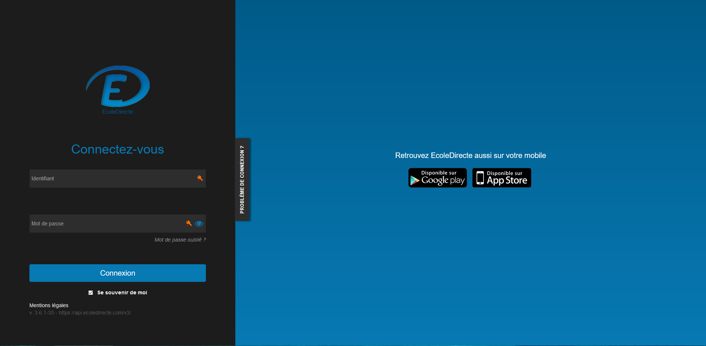
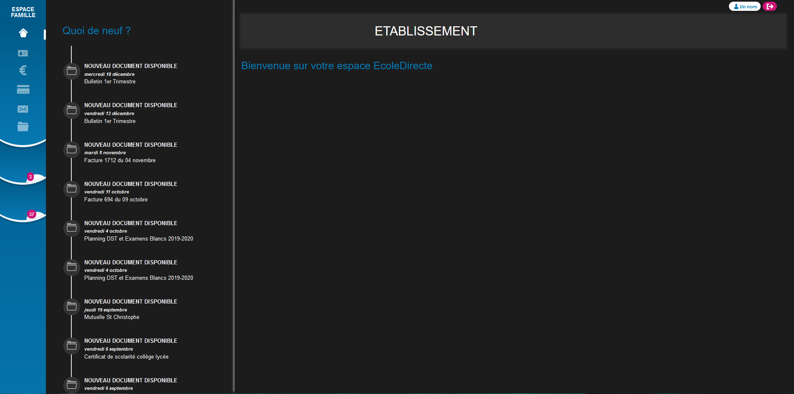
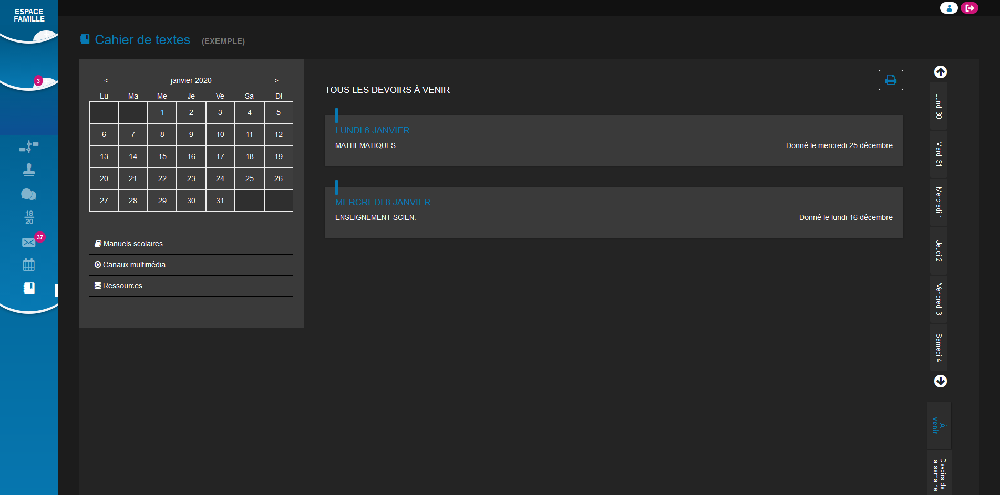

# Dark EcoleDirecte
A dark theme for EcoleDirecte (v3.6.1)

## Installation
Install Stylus if you are using Firefox, Chrome or Opera.
If you are on Safari, install Cascadea. 

Then you can acquire this theme using one of these methods: 
📦 [Install the usercss](https://raw.githubusercontent.com/EvanG-Styles/UserStyles/master/Dark%20EcoleDirecte/style.user.css) which supports automatic updates and personalization in real time. 
📦 [Install from UserStyles](https://userstyles.org/styles/178762) which requires manual updates and customization must be done during installation. 
📦 [Install manually from GitHub](style.css) (Mozilla format) which requires manual updates and no customization can be done. 

## Screenshot
|                                          |                                          |                                          |
|:----------------------------------------:|:----------------------------------------:|:----------------------------------------:|
|                |                  |          |
